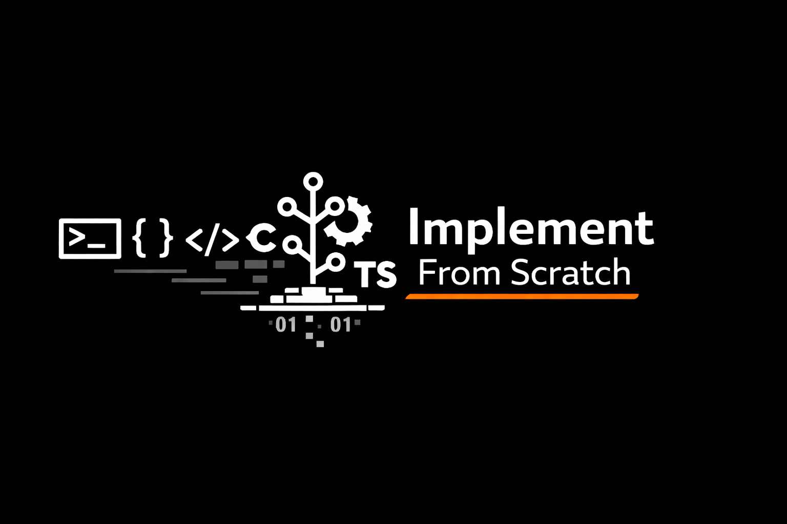

# Implement From Scratch

## Overview

This is a dedicated engineering organization focused on the bottom-up reconstruction of core software infrastructure. Our mission is to dismantle the "black box" of modern computing by providing decent-quality, educational implementations of complex systems. We prioritize deep technical understanding over high-level abstraction, offering a laboratory for developers to master systems programming through direct implementation.

## Technical Scope

Our curriculum covers the entire stack of systems engineering, categorized into four primary pillars:

1. Foundations: Memory management, process scheduling, and hardware-software interfaces.
2. Data Systems: In-memory datastores, relational databases, and transactional storage engines.
3. Networking: Low-level protocol stacks, asynchronous I/O, and distributed systems consensus.
4. Tooling: Compilers, virtual machines, interpreters, and performance profilers.

## Out of Scope
1. None of the implementation are intended to be used for production or EVER created keeping production in mind.
2. These are educational content that can be used by anyone to learn their way with system by doing things.

## Language Strategy

We maintain a multi-paradigm approach to systems design:

* C: For hardware-proximate logic, manual memory management, and understanding the machine model.
* C++: For zero-cost abstractions, object-oriented systems design, and resource management via RAII.
* Rust: For modern systems safety, fearless concurrency, and exploring the ownership/borrowing model.

## Principles of the Organization

* Implementation First: We prioritize working code over theoretical prose.
* Exemplary Quality: Codebases must be idiomatic, well-documented, and covered by rigorous test suites.
* Comparative Learning: Whenever possible, we provide side-by-side implementations in different languages to highlight architectural trade-offs.
* No Magic: We avoid heavy third-party dependencies to ensure the logic of the system remains visible.
